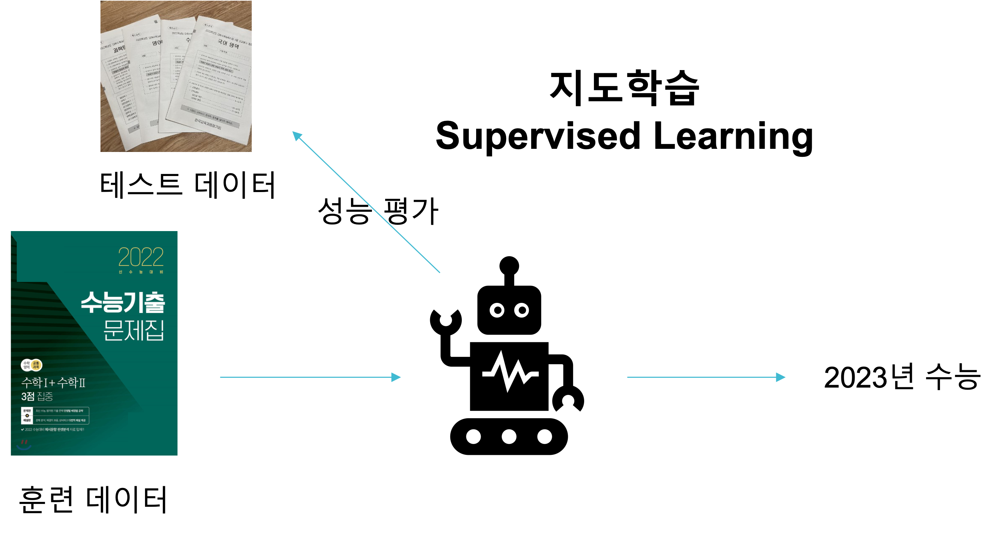
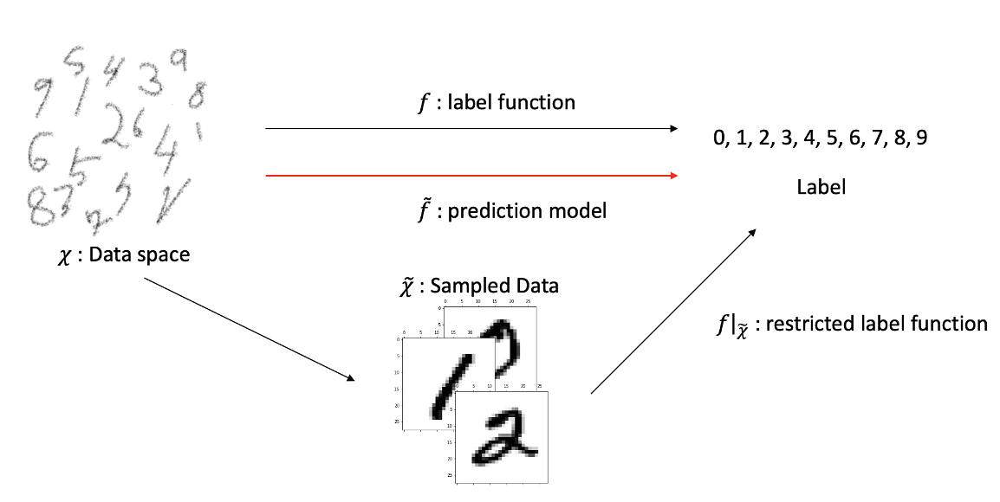
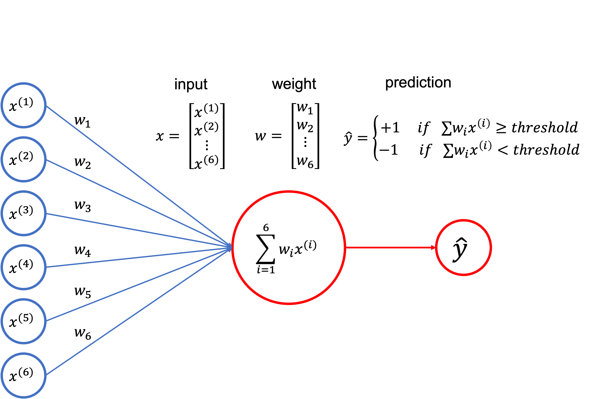

# [머신러닝 정리] 

본 포스팅 시리즈는 다양한 머신러닝 테크닉에 대해 수학적 관점과 실용적 관점에서 정리합니다.

필자는 수학을 전공했기 때문에 수학적 접근과 용어에 대해 익숙하게 사용한 것이 있지만, 수학을 전공하지 않은 사람들에겐 다소 낯선 접근과 용어가 있을 수 있습니다.

최대한 그러한 부분을 자세히 설명하려 노력하였지만 필자의 타전공자에 대한 '공감능력부족'으로 효과적으로 전달되지 못한 부분이 있을 것으로 생각됩니다.

이 글을 읽어주시는 분께 일차적으로 감사드리며, 해당 부분에 대해 질문이나 코멘트를 남겨주시는 분께는 거듭제곱으로 감사드림을 말씀드립니다.

> 📄 **참고문헌**
> 
> 1. iAI POSTECH 이승철 교수님의 Machine Learning 강의 노트 
> 2. 

---

## 1. Classification 

> 📌  **핵심 Keyword** 
>
> - **이진분류 문제 (Binary Classification)** : 두 가지 클래스의 데이터를 분류하는 문제.
> - **선형분류 문제 (Linear Classification)** : 선형결정경계에 의해 완벽히 분류가 되는 이진분류 문제.
> - **퍼셉트론 (Perceptron)** : 입력특성에 대한 가중합이 한계값을 넘는지 아닌지를 기준으로 클래스를 예측하는 모델.
>

---
### § 1.1) 이진분류 (Binary Classification)

$\mathcal{X} (\subseteq \mathbb{R}^d)$는 $d$개의 특성으로 표현되는 입력 데이터의 공간, $\mathcal{Y}$는 데이터로부터 만들어지는 출력값의 공간이라고 합시다.
인공지능 모델 중 **지도학습** 모델은 데이터가 $\left\{(x_1,y_1), (x_2,y_2),\ldots, (x_N,y_N) : x_i \in \mathcal{X}, y_i \in \mathcal{Y} ,\;i = 1,2,\ldots, N \right\}$의 형태로 주어질 때, 이를 학습하는 모델을 말합니다.

**분류**(Classification)은 인공지능으로 풀 수 있는 가장 대표적인 문제 입니다.
분류 문제는 데이터의 출력공간 $\mathcal{Y}$가 **이산적**(discrete)한 경우를 말합니다.

**이진분류**(Binary classfication) 문제는 데이터가 두 개의 클래스로 분류될 수 있는 문제를 말합니다.
즉, $\mathcal{Y}$의 원소 개수가 2개인 경우를 말합니다.

예를들어, 소비자들의 다양한 정보를 입력받아 이 소비자가 특정 상품을 구매 할지 안할지 예측하는 문제나, 신호에 대한 정보를 입력받아 이 정보가 진짜 신호인지 가짜 신호인지 분별하는 문제가 이진분류 문제입니다.

이진분류 문제에서 출력변수 $y \in \mathcal{Y}$는 0 또는 1, +1 또는 -1, 참 또는 거짓, Yes 또는 NO 등으로 표현합니다.

오늘 소개할 퍼셉트론 모델, 그리고 앞으로 소개할 [서포트 벡터 머신](https://velog.io/@shlee0125/%EB%A8%B8%EC%8B%A0%EB%9F%AC%EB%8B%9D-%EC%A0%95%EB%A6%AC-Support-Vector-Machine-01.-Introduction)은 대표적인 이진분류 모델들이고, 이들을 다룰 때에 출력변수의 값은 +1 또는 -1로 표기하는 것이 관습입니다.

이진분류 문제를 수학적으로 표현해봅시다.

> ***Definition 1.1)*** (Binary Classification)
> 
> $N$개의 데이터 $\left\{(x_1,y_1), (x_2,y_2), \ldots , (x_N, y_N)\right\}$으로 구성된  지도학습 훈련 데이터가 주어졌다고 하자.
> 여기서 $x_i \in \mathbb{R}^d$이고, $y_i \in \mathcal{Y} = \left\{-1,+1\right\}$ 이다.
> **이진분류**(Binary classification) 문제는 훈련 데이터를 학습하여 분류 오차가 최소가 되게 하는 분류함수 
>
>$$
>G : \mathbb{R}^d \rightarrow \left\{-1, +1 \right\}
>$$
> 를 모델링하는 것이다. 

### § 1.2 ) 선형분류 (Linear classification)

**선형분류**(Linear classification) 문제는 훈련 데이터로부터 적절한 **선형함수** 

$$
f(x) = x^T w + w_0
$$

를 모델링해, 이로부터 데이터의 클래스를 분리할 수 있는 **초평면**(hyper plane)

$$
\left\{ x \in \mathbb{R}^d : f(x) = x^T w + w_0 = 0 \right\}
$$

을 찾는 문제입니다.

여기서 $w_0 \in \mathbb{R}$은 선형함수 $f$의 **절편**(intercept)이며, 파라미터 $w \in \mathbb{R}^d$는 초평면에 수직인 단위벡터, 즉 **법선벡터**(normal vector)입니다.

이진 분류 문제와 결정경계를 시각화해보았습니다.
그림에서 관찰할 수 있듯, 결정경계는 여러가지로 결정될 수 있습니다. 
그렇다면 이러한 결정경계는 어떤 식으로 찾을 수 있을까요?

### § 1.3) 퍼셉트론(Perceptron)

**퍼셉트론**(Perceptron)은 가장 고전적인 선형 분류 모델입니다.
퍼셉트론을 실용적으로 많이 사용하지는 않지만, 퍼셉트론 모델은 분류문제의 해법을 이해하기 가장 쉬운 모델이면서 [서포트 벡터 머신](https://velog.io/@shlee0125/%EB%A8%B8%EC%8B%A0%EB%9F%AC%EB%8B%9D-%EC%A0%95%EB%A6%AC-Support-Vector-Machine-01.-Introduction)이나 딥 러닝 등의 강력한 모델들이 모두 퍼셉트론의 변형이라는 점에서 배울 가치가 있습니다.

직관적으로 퍼셉트론이 작동하는 방식은 매우 단순합니다.
입력 정보 $x=\begin{bmatrix}x^{(1)} \\ x^{(2)} \\ \vdots  \\ x^{(d)} \end{bmatrix}$에 대해 각 특성 $x_i$에 대한 가중치 $w_i$를 곱해 더합니다.
이 값은 $\sum_{i=1}^d w_ix^{(i)}$의 꼴로 표현될 것입니다.
그리고 이 가중합이 **한계점**(threshold)을 넘어선다면, 이를 $\hat{y} = +1$로 예측하고, 그렇지 않으면 $\hat{y} = -1$로 예측하는 것입니다.
즉, 퍼셉트론 모델의 예측은 아래와 같이 이루어집니다.

$$
\hat{y} = \begin{cases}
 +1 & \text{ if } \sum_{i=1}^d w_i x^{(i)} \leq threshold \\
-1 & \text{ if } \sum_{i=1}^d w_i x^{(i)} < threshold
\end{cases}
$$

이때 한계점($threshold$)을 $w_0$으로 두고, $w_0$에 대한 입력값 $x_0$를 1로 설정하면 퍼셉트론의 예측은 다음과 같이 단순하게 표기될 수 있습니다.

$$ \hat{y} = sign\left(\sum_{i=0}^d w_i x^{(i)}\right)$$

여기서 $sign(x) = \begin{cases} +1 & (x \geq 0) \\ -1 & (x < 0)\end{cases}$는 **부호함수**(sign function)입니다.

퍼셉트론이 만들어내는 값 $\sum_{i=0}^d w_i x^{(i)}$은 $x^T w + w_0$로 표기할 수 있음을 관찰하면, 금새 퍼셉트론이 선형모델임을 알 수 있습니다.
따라서 퍼셉트론 모델을 구현하는 것으로 선형 결정경계를 찾을 수 있습니다.

### § 1.4) 결정경계 (Decision Boundary)

퍼셉트론 모델은 선형함수 $f(x)=x^Tw + w_0$에 의해 

$$
\hat{y} = sign[f(x)] = sign[x^Tw + w_0]
$$

로 예측을 만든다고 했습니다.

이때 선형함수 $f(x)$에 의해 결정되는 초평면 $\left\{ x \in \mathbb{R}^d : f(x) = x^T w+ w_0 = 0 \right\}$를 퍼셉트론 모델에 의해 생성된 **결정경계**(Decision boundary)라고 부릅니다.

선형함수 $f(x)$의 가중치 파라미터 $w$는 결정경계를 기준으로 예측값의 방향을 결정합니다.
데이터 $x$에 대하여 $f(x) \geq 0$이면 결정경계의 **양의 방향**에 놓인다고 하며, 이 경우 $G(x) = +1$ 입니다.
마찬가지로 $f(x) < 0$이면 데이터가 결정경계의 **음의 방향**에 놓인다고 하며, 이 경우 $G(x) = -1$ 입니다.

훈련 데이터 $x_i$가 $y_i = +1$의 레이블을 가진다면, $f(x_i) \geq 0$이 되어야 $G(x_i) = +1$이 됩니다.
마찬가지로 $y_i = -1$의 레이블을 가진다면, $f(x_i) < 0$이 되어야 $G(x_i) = -1$이 되어 정확한 예측이 됩니다.
그러므로 $y_if(x_i) \geq 0$이면 모델이 훈련 데이터 $x_i$의 클래스 $y_i$를 정확히 예측했다고 할 수 있습니다.

**선형분리 가능 문제**(Linearly separable problem)는 모든 $i$에 대하여 $y_if(x_i) \leq 0$이 되게 하는 선형함수 $f(x) = x^T w + w_0$를 찾을 수 있는 문제를 말합니다.
학습된 데이터로부터 선형결정경계를 만드는 모델을 **선형 분류기**(Linear classifier)라고 부릅니다.

따라서 **퍼셉트론 모델은 선형 분류기이며, 선형분리 가능 문제에 적용할 수 있습니다**.

### § 1.5) 퍼셉트론의 학습

지금까지 퍼셉트론 모델이 어떻게 예측을 만드는지 알아보았습니다. 
그런데 퍼셉트론 모델로 정확한 예측을 하기 위해서는 가중치 $w_0, w_1, \ldots, w_d$의 값을 잘 지정해주어야 합니다.

여기서 독자 여러분이 명심해야할 사고방식이 있습니다.
가중치 $w_0, w_1, \ldots, w_d$를 결정하는 방법은 여러가지일 수 있을 것입니다.

그러나 소위 인공지능이라 불리는 방법론은 **데이터를 학습하여 모델이 스스로 적절한 가중치 $w_0, w_1, \ldots, w_d$를 찾아나가는 방법**을 말한다는 것입니다.
이를 퍼셉트론 모델 내지는 인공지능을 학습시킨다고 말합니다.

이처럼 데이터를 학습하면서 점차 가중치를 개선해나가는 알고리즘을 **경사하강법**(Gradient Descent)라고 부릅니다.

다음 포스팅에서는 기하학적인 관점에서 퍼셉트론 모델의 학습이 어떻게 진행되는지 살펴보도록 하겠습니다.

> 📌  **요약 Summary**
>
> - **선형이진분류** 문제는 선형결정경계로 두 가지 클래스의 데이터를 분류하는 문제다.
> - **퍼셉트론 모델**은 선형이진분류 문제를 풀기 위한 선형 분류기이다.
> - **인공지능 모델**은 데이터를 학습하여 모델의 가중치를 점차 적절한 값으로 찾아나가는 방법을 취한다.
> 

